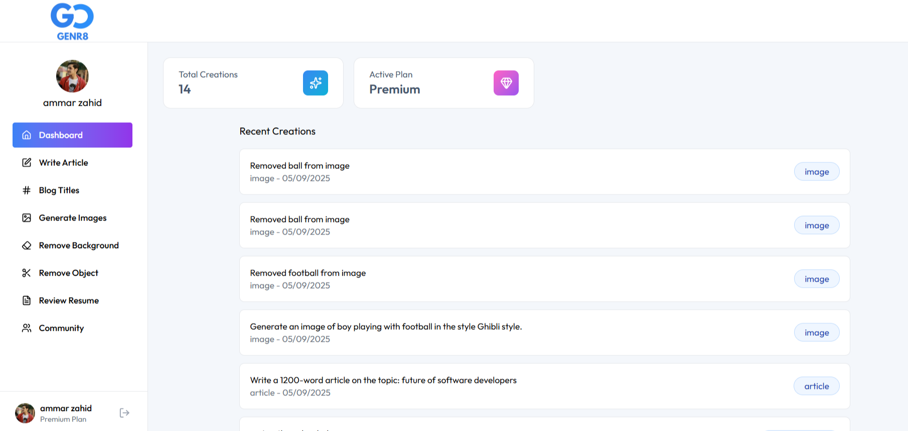
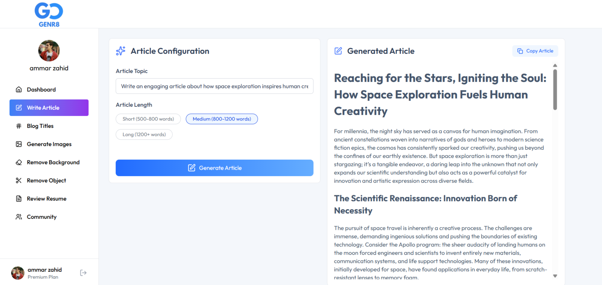
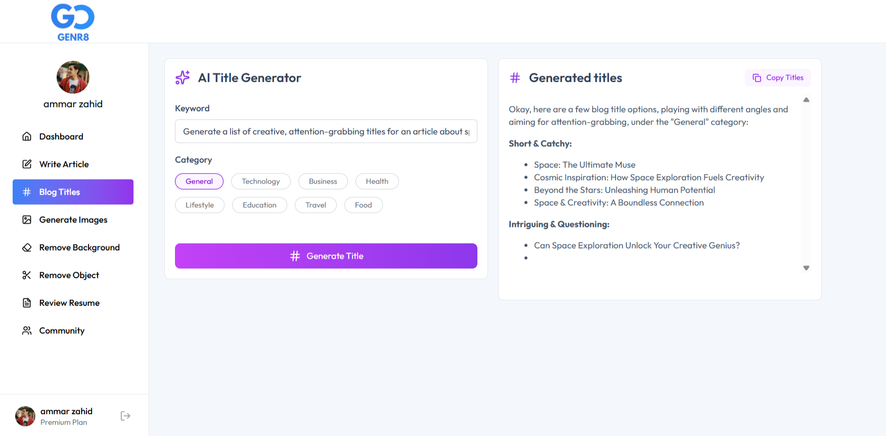
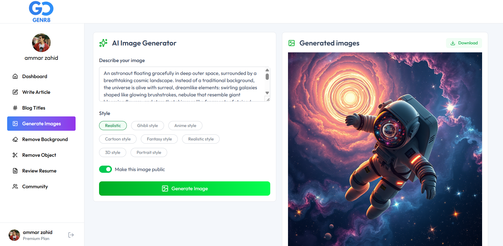
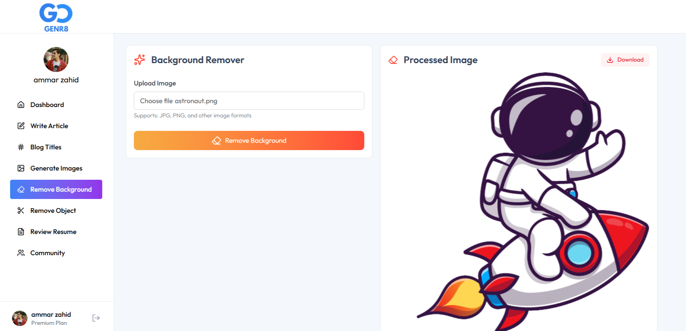
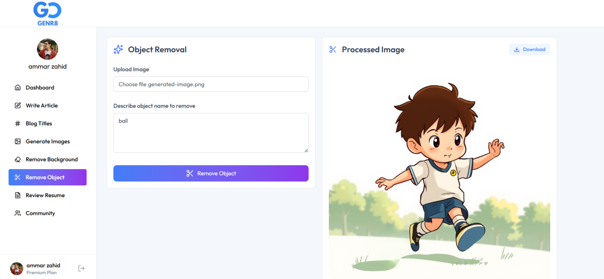
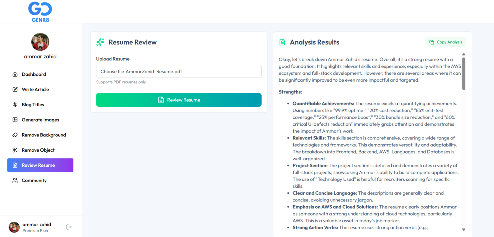
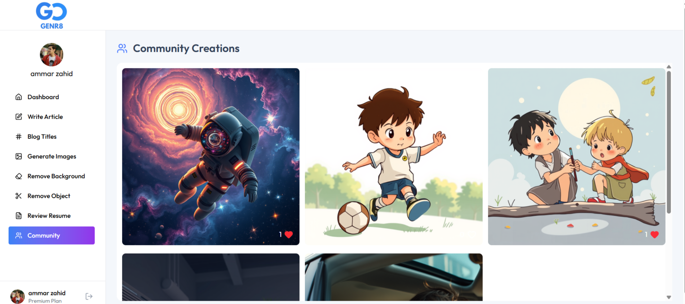

# 🚀 Genr8 - AI SaaS Platform

A comprehensive AI-powered SaaS application that provides multiple AI services including content generation, image processing, and professional tools. Built with modern technologies and designed for scalability.

## 📸 Screenshots

### 🏠 Home Page

- Landing page with hero section
- Feature highlights and pricing overview
- Clean, modern design with gradient backgrounds

### 📊 Dashboard

- User statistics and metrics
- Recent creations with accordion-style expansion
- Plan status indicator (Free/Premium)
- Copy/download buttons for all creations
- Quick access to previous work

### ✍️ AI Article Writer

- Topic input with length selection
- Real-time generation with loading states
- Markdown-formatted output with copy functionality
- One-click copy button for easy sharing

### 🏷️ Blog Title Generator

- Category and keyword-based generation
- Multiple title suggestions
- Industry-specific optimization
- Copy functionality for generated titles

### 🎨 AI Image Generator (Premium)

- Text-to-image generation with style options
- High-quality AI-generated artwork
- Public/private publishing options
- Direct download functionality

### 🖼️ Background Removal (Premium)

- Professional background removal tool
- Drag-and-drop file upload
- Instant processing and download
- High-quality output with transparency

### ✂️ Object Removal (Premium)

- Smart object detection and removal
- Natural background filling
- Professional editing capabilities
- Download processed images instantly

### 📄 Resume Review (Premium)

- AI-powered resume analysis
- Detailed feedback and suggestions
- Professional improvement recommendations
- Copy analysis results for reference

### 🌟 Community Gallery

- Published AI creations showcase
- Like/unlike functionality with animations
- Instagram-style interactions
- Copy prompts and download images
- Expandable prompt descriptions

## 🛠️ Technologies Used

### Frontend
- **React 18** - Modern UI framework with hooks
- **Tailwind CSS** - Utility-first CSS framework
- **Lucide React** - Beautiful icon library
- **React Markdown** - Markdown rendering for AI content
- **React Router** - Client-side routing
- **Axios** - HTTP client for API calls
- **React Hot Toast** - Toast notifications

### Backend
- **Node.js** - Server runtime environment
- **Express.js** - Web application framework
- **PostgreSQL** - Relational database
- **Clerk** - Authentication and user management
- **Multer** - File upload handling
- **PDF-Parse** - PDF text extraction
- **CORS** - Cross-origin resource sharing

### AI & External Services
- **Google Gemini API** - Text generation and analysis
- **ClipDrop API** - AI image generation
- **Cloudinary** - Image storage and transformations
- **OpenAI SDK** - AI service integration

### Development Tools
- **Vite** - Fast build tool and development server
- **ESLint** - Code linting and formatting
- **Git** - Version control
- **Environment Variables** - Secure configuration management

## ⚡ Features

### 🎯 Core AI Services

#### 1. **Content Generation**
- **AI Article Writer**: Generate comprehensive articles (500-1600 words)
- **Blog Title Generator**: Create engaging titles with keyword optimization
- **Multiple Length Options**: Short, medium, and long-form content
- **Markdown Support**: Rich text formatting for professional output
- **Copy Functionality**: One-click copy for all generated content
- **Export Options**: Easy sharing and reuse of AI-generated text

#### 2. **Image Processing (Premium)**
- **AI Image Generator**: Text-to-image with multiple style options
- **Background Removal**: Professional-grade background elimination
- **Object Removal**: Smart object detection and seamless removal
- **High-Quality Output**: Professional editing capabilities
- **Download Functionality**: Direct download of processed images
- **Multiple Formats**: Support for various image file types

#### 3. **Professional Tools (Premium)**
- **Resume Review**: Comprehensive AI analysis with actionable feedback
- **PDF Processing**: Extract and analyze resume content
- **Industry Insights**: Tailored advice for different career fields
- **Copy Analysis**: Export resume feedback for reference
- **Detailed Reports**: Professional improvement recommendations

### 🎨 User Experience

#### **Dashboard Features**
- **Usage Statistics**: Track total creations and plan status
- **Recent Creations**: Accordion-style browsing with smooth animations
- **Plan Management**: Clear free vs premium feature distinction
- **Creation Management**: Copy/download buttons for all generated content
- **Quick Actions**: Easy access to previous work and exports

#### **Community Features**
- **Public Gallery**: Showcase published AI creations
- **Social Interactions**: Like/unlike with Instagram-style animations
- **Real-time Updates**: Optimistic UI updates for instant feedback
- **Prompt Sharing**: Copy prompts for inspiration and reuse
- **Image Downloads**: Save community creations locally
- **Expandable Prompts**: Smart truncation with full-text expansion

#### **Modern UI/UX**
- **Responsive Design**: Mobile-first, works on all devices
- **Loading States**: Smooth transitions and loading indicators
- **Error Handling**: User-friendly error messages and recovery
- **Smooth Animations**: Professional transitions and micro-interactions

### 💼 Business Model

#### **Freemium Structure**
- **Free Tier**: 10 generations for content creation tools
- **Premium Features**: Unlimited access + exclusive image/resume tools
- **Usage Tracking**: Transparent limit monitoring
- **Upgrade Prompts**: Seamless premium conversion flow

## 🚀 Installation & Setup

### Prerequisites
- Node.js (v16 or higher)
- PostgreSQL database
- Clerk account for authentication
- API keys for AI services

### Environment Variables

Create `.env` files in both client and server directories:

#### Server `.env`
```env
# Database
DATABASE_URL=your_postgresql_connection_string

# Authentication
CLERK_PUBLISHABLE_KEY=your_clerk_publishable_key
CLERK_SECRET_KEY=your_clerk_secret_key

# AI Services
GEMINI_API_KEY=your_google_gemini_api_key
CLIPDROP_API_KEY=your_clipdrop_api_key

# Image Storage
CLOUDINARY_CLOUD_NAME=your_cloudinary_cloud_name
CLOUDINARY_API_KEY=your_cloudinary_api_key
CLOUDINARY_API_SECRET=your_cloudinary_api_secret

# Server Configuration
PORT=3000
```

#### Client `.env`
```env
VITE_BASE_URL=http://localhost:5000
VITE_CLERK_PUBLISHABLE_KEY=your_clerk_publishable_key
```

### Installation Steps

1. **Clone the repository**
```bash
git clone 
cd easyprompt-app
```

2. **Install server dependencies**
```bash
cd server
npm install
```

3. **Install client dependencies**
```bash
cd ../client
npm install
```

4. **Set up database**
```bash
# Create PostgreSQL database and tables
# Run migration scripts if available
```

5. **Start development servers**

Terminal 1 (Server):
```bash
cd server
npm run server
```

Terminal 2 (Client):
```bash
cd client
npm run dev
```

6. **Access the application**
- Frontend: `http://localhost:5173`
- Backend: `http://localhost:3000`

## 📡 API Endpoints

### Authentication Routes
- `GET /api/user/get-user-creations` - Fetch user's creations
- `GET /api/user/get-published-creations` - Fetch community creations
- `POST /api/user/toggle-like-creations` - Toggle like on creation

### AI Service Routes
- `POST /api/ai/generate-article` - Generate AI article
- `POST /api/ai/generate-blog-title` - Generate blog titles
- `POST /api/ai/generate-image` - Generate AI image (Premium)
- `POST /api/ai/remove-image-background` - Remove background (Premium)
- `POST /api/ai/remove-image-object` - Remove object (Premium)
- `POST /api/ai/resume-review` - Analyze resume (Premium)

## 🏗️ Project Structure

```
Genr8/
├── client/                 # React frontend
│   ├── public/            # Static assets
│   ├── src/
│   │   ├── components/    # Reusable UI components
│   │   ├── pages/         # Main application pages
│   │   ├── assets/        # Images and static files
│   │   └── main.jsx       # Application entry point
│   ├── package.json
│   └── vite.config.js
├── server/                # Node.js backend
│   ├── controllers/       # Route controllers
│   ├── middleware/        # Custom middleware
│   ├── routes/           # API route definitions
│   ├── uploads/          # File upload directory
│   ├── package.json
│   └── server.js         # Server entry point
└── README.md
```

## 🎯 Key Components

### Frontend Components
- **Layout.jsx** - Main application layout with sidebar
- **Dashboard.jsx** - User dashboard with statistics
- **CreationsItem.jsx** - Accordion-style creation display
- **Community.jsx** - Social gallery with interactions
- **Navbar.jsx** - Navigation with user authentication
- **AiTools.jsx** - AI service interfaces

### Backend Controllers
- **aiController.js** - All AI service logic
- **userController.js** - User and creation management
- **authMiddleware.js** - Authentication verification

## 🔒 Security Features

- **JWT Authentication** - Secure API access
- **Input Validation** - Prevent malicious inputs
- **File Type Restrictions** - Safe file uploads
- **Rate Limiting** - Prevent API abuse
- **Environment Variables** - Secure configuration
- **CORS Configuration** - Controlled cross-origin access

## 🎨 Design Philosophy

- **Mobile-First** - Responsive design from ground up
- **Accessibility** - WCAG compliant interfaces
- **Performance** - Optimized loading and interactions
- **User-Centric** - Intuitive workflows and feedback
- **Professional** - Clean, modern aesthetic

## 🚀 Deployment

### Frontend (Vercel/Netlify)
1. Build the client application
2. Configure environment variables
3. Deploy static files
4. Set up custom domain

### Backend (Railway/Heroku)
1. Set up PostgreSQL database
2. Configure environment variables
3. Deploy Node.js application
4. Set up SSL certificates

## 📈 Future Enhancements

- **Infinite Scroll Pagination** - Community gallery with lazy loading (15 images per batch)
  - Performance optimization for large datasets
  - Automatic loading on scroll with smooth animations
  - Memory-efficient image rendering
- **Advanced Analytics** - Detailed usage metrics
- **Team Collaboration** - Multi-user workspaces
- **API Integration** - Third-party service connections
- **Mobile App** - Native iOS/Android applications
- **Advanced AI Models** - Latest AI service integrations

## 🤝 Contributing

1. Fork the repository
2. Create a feature branch
3. Commit your changes
4. Push to the branch
5. Open a Pull Request

## 📄 License

This project is licensed under the MIT License - see the [LICENSE](LICENSE) file for details.

## 👨‍💻 Author

**Ammar Zahid**
- GitHub: https://github.com/ammar1zahid
- Project: 

## 🙏 Acknowledgments

- Google Gemini for AI text generation
- ClipDrop for AI image generation
- Cloudinary for image processing
- Clerk for authentication services
- The open-source community for amazing tools

---

*Built with ❤️ using modern web technologies*
